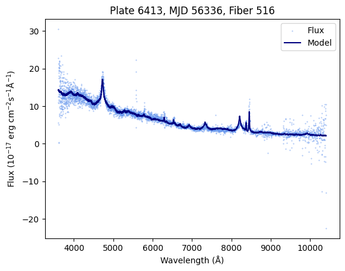

# Classification of Stellar Objects

This repository is the culmination of a two-semester senior design course with [Professor Jianting Zhang](https://www.ccny.cuny.edu/profiles/jianting-zhang) at the [City College of New York](https://ccny.cuny.edu). The course was built around the [CUDA](https://en.wikipedia.org/wiki/CUDA) technology, and we learned how it can be used to process very large datasets in parallel much quicker than you would be able to using just CPU compute.

## Introduction

This particular project involves processing spectrograph data from the Sloan Digital Sky Survey, which describes the strengths and wavelengths of light reflected back from several millions of stars. From this data, we hope to determine the both the [classification](https://en.wikipedia.org/wiki/Stellar_classification) of the star as per the Morgan–Keenan system, and a rough idea of the elements that make up the star.

The full project proposal can be found [here](./docs/proposal.pdf).

### Collaborators
- Aila Choudhary ([GitHub](https://github.com/), [LinkedIn](https://www.linkedin.com/in/aila-choudhary/))
- Simona Isakova ([GitHub](https://github.com/buringskul), [LinkedIn](https://www.linkedin.com/in/simona-isakova/))
- Ramses Lora ([GitHub](https://github.com/buringskul))
- Michael Romashov ([GitHub](https://github.com/MikeRomaa), [LinkedIn](https://www.linkedin.com/in/mikeromaa/))

## Development

### Proof of Concept

To prove to ourselves that the data from SDSS can be read, and that we can reasonably handle the volume of data, a couple of Jupyter notebooks were created.

- [`read_fits.ipynb`](./notebooks/read_fits.ipynb) is all about familiarizing ourselves with the [FITS](https://en.wikipedia.org/wiki/FITS) file format, which is how all spectral data is made available through SDSS's [Science Archive Server](https://dr18.sdss.org/home).

    We began with the [`astropy`](https://www.astropy.org/) Python package, which includes a handy module for dealing with FITS files. We picked a spectrograph at random and looked at what metadata was available, as well as what series were recorded and how we could interpret them.

    A little bit of tinkering later we managed to create this plot of the raw spectrograph data (which measures something called "flux") as well as a best-fit model that was included in the file. To our delight, this seemed to match the [visualization](https://dr18.sdss.org/optical/spectrum/view?plateid=6413&mjd=56336&fiberid=516) available on SDSS's website.

    

    Now that we're acquantainced with how to read the data, it's time to figure out how to obtain it in bulk for at least a fraction of the dataset we were hoping to work with.

- [`download_fits.ipynb`](./notebooks/download_fits.ipynb) is about gauging just how much data we are dealing with and if there is any way to slim it down to just the essentials.

    Here we make use of another one of SDSS's services—the [SQL search engine](https://skyserver.sdss.org/dr18/SearchTools/sql)—to generate download links for several different spectrographs. When we were playing around with the FITS files earlier, we were using a link embedded on the website that looked like this:

    ```
    https://dr18.sdss.org/sas/dr18/spectro/sdss/redux/v5_13_2/spectra/lite/6413/spec-6413-56336-0516.fits
    ```

    After looking through the table schemas and cross referencing the hundreds of columns with the download URL we already had, the format looked to be something along the lines of:

    ```html
    https://dr18.sdss.org/sas/dr18/spectro/sdss/redux/<version>/spectra/lite/<plate>/spec-<plate>-<mjd>-<fiber>.fits
    ```

    In the above URL, `version` is a tag assigned to a particular generation of SDSS imaging, `plate` and `fiber` identify locations on the [recording equipment](https://www.sdss.org/dr18/targeting/plates/) (which happens to be a large aluminum plate with literal fibers sticking out of it—its all very interesting), and `mjd` is the [Modified Julian Date](https://scienceworld.wolfram.com/astronomy/ModifiedJulianDate.html) of when the observation was made.

    With this in mind, we can create a more informed SQL query to obtain the download URLs for several spectrographs at once:

    ```sql
    -- We'll just do a 100 for now, no need to get carried away from the start
    SELECT TOP 100
        spec.plate AS plate,
        spec.mjd AS mjd,
        spec.fiberID as fiber,
        spec.run2d AS version,
        CONCAT(
            'https://dr18.sdss.org/sas/dr18/spectro/sdss/redux/',
            spec.run2d,
            '/spectra/lite/',
            RIGHT(CONCAT('000', spec.plate), 4),
            '/spec-',
            RIGHT(CONCAT('000', spec.plate), 4),
            '-',
            RIGHT(CONCAT('0000', spec.mjd), 5),
            '-',
            RIGHT(CONCAT('000', spec.fiberID), 4),
            '.fits'
        ) AS url
    FROM SpecObj AS spec
    -- Filters out any spectra that have known problems
    WHERE
        spec.zWarning = 0 AND
        spec.class = "STAR"
    ORDER BY NEWID()
    ```

    We used what we learned from poking at the FITS files and identified the minimal required data that we needed, and removed the rest for each file we are processing. For 100 files, we started with a total size of around 22 MB and got that down to just 4 MB.

    ```
      Original: 21.89 mb
    Compressed:  4.03 mb
         Ratio:  5.43 x
    ```

    This meant that for 1 million stellar objects we would be looking at a relatively compact 40 GB—well within reason and easy enough to batch up for processing on a GPU later in the project.
